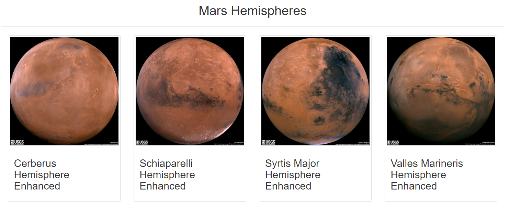

# **Mission_to_Mars**
# **Web Scraping with HTML CSS**
	
## **Overview of Movies ETL Analysis** 

* Robin's web app is looking good and functioning well, but she wants to add more polish to it. She had been admiring images of Mars’s hemispheres online and realized that the site is scraping-friendly. She would like to adjust the current web app to include all four of the hemisphere images. we will help her by using BeautifulSoup and Splinter to scrape full-resolution images of Mars’s hemispheres and the titles of those images, store the scraped data on a Mongo database, use a web application to display the data, and alter the design of the web app to accommodate these images. 

### Purpose 

* Scrape Full-Resolution Mars Hemisphere Images and Titles
* Update the Web App with Mars Hemisphere Images and Titles
* Add Bootstrap 3 Components

* Hemisphere Images

